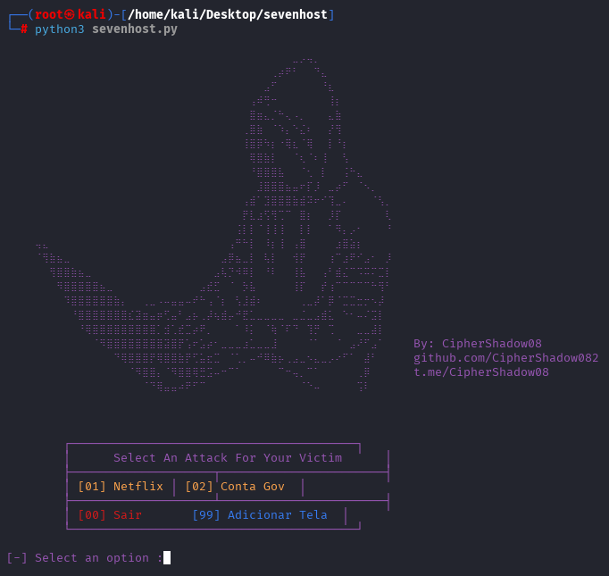

# 🔒 PhantomHost

Programa em Python para hospedagem de telas fake via tunelamento reverso.

## Funcionalidades
- Geração de URLs públicas para interfaces locais
- Templates pré-configurados para diversos cenários
- Rotação automática de endpoints
- Logs temporários (auto-exclusão)

## Requisitos
- Python 3.8+
- Terminal
